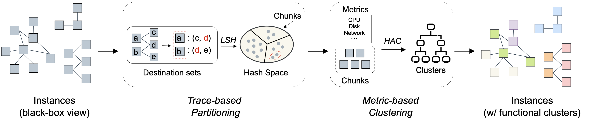

## Prism: Revealing Hidden Functional Clusters from Massive Instances in Cloud Systems

This is the repository of **Prism** for the paper "Jinyang Liu, Zhihan Jiang, Jiazhen Gu, Junjie Huang, Zhuangbin Chen, Cong Feng, Zengyin Yang, Yongqiang Yang, Michael R. Lyu. [Prism: Revealing Hidden Functional Clusters of Massive Instances in Cloud Systems](https://arxiv.org/pdf/2308.07638.pdf)" accepted by ASE 2023.

In this paper, we propose **Prism**, a non-intrusive, effective and efficient solution that infers functional clusters of instances from the communication and resource usage patterns in large-scale cloud systems. 




### Repository Organization 

```
├── common/
│   ├── evaluation.py # Evaluation metrics of clustering results
│   └── utils.py 
├── data/
│   ├── anonymized_trace.csv # The communication trace data
│   ├── anonymized_metadata.pkl # The metadata between IPs and instances
│   ├── anonymized_metric.pkl # The resource usage metric data
│   └── anonymized_label.csv # The functional cluster labels
├── src/
│   ├── MultiLevelClustering.py # Multivariate Time Series Clustering
│   ├── trace_partitioning.py # Trace-based partitioning
│   └── metric_clustering.py # Metric-based clustering
├── ourdir/
├── requirements.txt
└── README.MD
```

### Quick Start

#### Installation

1. Install [python >= 3.8](https://www.python.org/downloads/).

2. Install the dependency needed by Prism with the following command.

​		```pip install -r requirements.txt```

#### Execution

- Run **Trace-based Partitioning**

```bash
cd src
python trace_partitioning.py
```

​		Then, the result of trace-based partitioning will be saved to ```outdir/threshold_*.pkl``` .

- Run **Metric-based Clustering**

```bash
cd src
python metric_clustering.py
```r

​		Then, the result of metric-based clustering will be saved to the corresponding subdir of ```outdir/```.

### Dataset

The communication trace data and resource usage data utilized in this study were gathered from Huawei Cloud. As this information is highly sensitive and contains significant amounts of personally identifiable information (PII), we are obligated to uphold our customers' privacy. Thus, we have opted not to publish the original dataset. Nonetheless, to ensure that our work can provide value to the community, we released **Prism**'s source code with a portion of *anonymized data*.

Specifically, we have anonymized, cleaned, and released relevant data for 1019 instances. Furthermore, we plan to release more data after the review process.


The following data contains anonymized data (the id of instances, IPs and functional cluster labels) to run **Prism**. *(One can seamlessly adapt **Prism** to another system by replacing them with data in the same format (schema).)*

#### Communication trace data between instances

- ```./data/anonymized_traffic.csv``` 

We filtered network packet transmission records and selected the data relevant to these 1019 instances. Also, we performed anonymization on it to protect the privacy.

#### Metadata to map IPs to instances

- ```./data/anonymized_metadata.pkl``` 

In general, the communication trace data contains IPs of instances. Therefore, we also leverage the metadata to link IPs to their respective instances. Additionally, we have performed anonymization on the IPs and instance IDs for security and privacy purposes.
The format of ```anonymized_metadata.pkl``` is ```{ip: {'vmid':id}}``` .

#### Resource usage data of instances

- ```./data/anonymized_metric.pkl``` 

We collected the 11 resource usage metrics of these instances at five-minute intervals.
The format of ```anonymized_metric.pkl``` is ```{id: {'metric1': [list], 'metric2}: [list], ...}```

#### Functional cluster labels of each instance

- ```./data/anonymized_label.csv```

We collected the functional cluster labels of all 1019 instances. For security and privacy purposes, we anonymized the functional cluster labels to ```cluster_i```.
